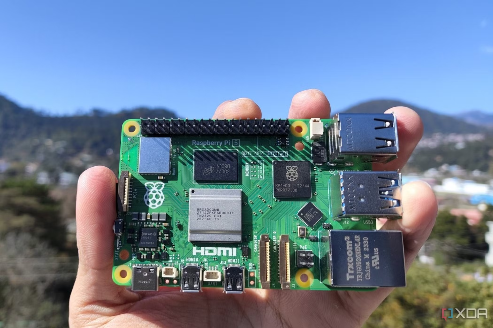
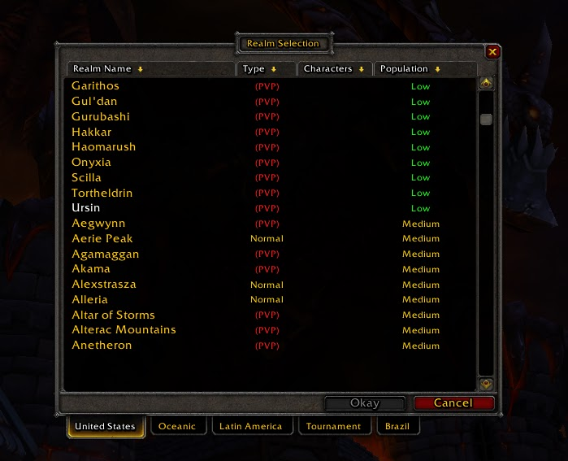
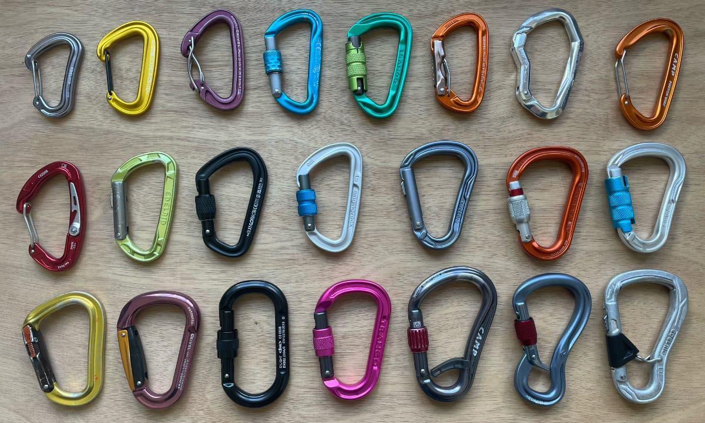
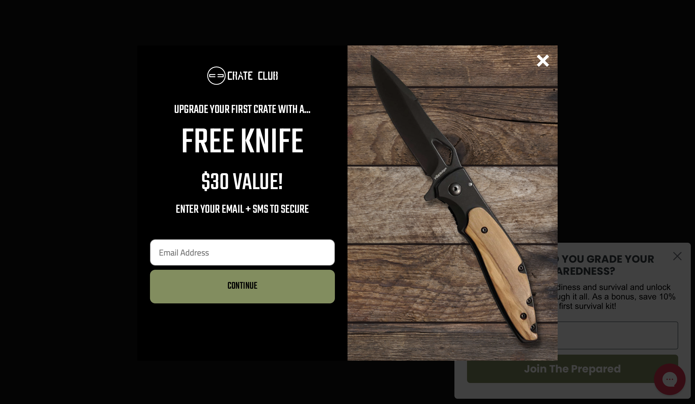

+++
title = "\"Back to base-ics\""
date = "2025-08-15"
updated = "2025-08-15"
+++

#### from the desk of [planetnineisaspaceship][planetnine]

# What's in a name?

Ursula K. Le Guin's fantastic A Wizard of Earthsea creates a world of magic where the greatest power one can hold over a person or thing is knowledge of its true name.
A friend of mine and I were lamenting that we never had the opportunity to run in to Le Guin while we were all in Portland (he's a big deal enough that this was a possibility, I am not). 
He also shared with me her essay on [The Carrier Bag Theory of Fiction][carrier-bag].

Those of you familiar with Planet Nine's lore will know that boats feature quite heavily. 
Boats have two properties that make them useful: they float, and they carry things from here to there. 
If we relax our definition of floating to include being carried, I hope you'll indulge me in acknowledging that the carrier bag, and the boat have much in common.

(I'd like to note too that Le Guinn acknowledges the importance of stacks in her essay, "home being another, larger
kind of pouch or bag, a container for people." 
Anyone who has been drinking with me as I try to explain stacks and boats will recognize this flexibility in terminology)

The gist of the theory, which comes from Elizabeth Fisher's Carrier Bag Theory of Human Evolution, is that though bags [and boats] are essential to humans, so much so that they were likely our earliest tool, they don't fit in well with the conflict-driven hero narratives of modern fiction.
Hero worship is not just in fiction, but I would say permeates all of popular culture in the United States. 
Whether quarterback, or diva, or pedophile-turned-president, whereas carrier bags are things you get when you donate twenty bucks to PBS, which normally you wouldn't do, but now you have to because of that stupid president.

Le Guin writes in her essay:

> One relationship among elements in the novel may well be that of
conflict, but the reduction of narrative to conflict is absurd. (I have
read a how-to-write manual that said, "A story should be seen as a
battle," and went on about strategies, attacks, victory, etc.) Conflict,
competition, stress, struggle, etc., within the narrative conceived as
carrier bag I belly I box I house I medicine bundle, may be seen as
necessary elements of a whole which itself cannot be characterized
either as conflict or as harmony, since its purpose is neither resolu-
tion nor stasis but continuing process.

> Finally, it's clear that the Hero does not look well in this bag. He
needs a stage or a pedestal or a pinnacle. You put him in a bag and
he looks like a rabbit, like a potato.

This notion of narrative as a _continuing_ process is intriguing. 
Aren't stories, by definition, in possession of an ending? 
But robbed of the need for resolution, why not just go on and on?

People haven't been writing computer programs nearly as long as we've been writing stories so we don't really know what we're doing yet, and it's probably unfair to map the latter to the former. 
But I don't think it's too far afield to say that the world of Facebook and Google has it's own hero-fetish that might not be the greatest when the story doesn't end. 
"You either die a hero or live long enough to see yourself become the villain," Harvey Dent was on to something.

If the gigantocorps are our heroes, constantly on stage peacocking about like the world owes them for their benevolence, what's the carrier bag for tech?
On Earthsea we would only have to speak its name to avail ourselves of its power.
Here on plain old Earth we need that name, and then we have to build it. 

We have an idea of what it might be.

We call it a **base**.

## Billions and billions

When the interwebs was kicking off the dotcom boom, there were six billion or so people on the planet.
Twenty-six years later there are eight billion. 
In real life, we call this increase a triumph of modern medicine, in the biz we call it a scaling problem. 

If you want to bore yourself nauseous for an hour, go look up system design interview prep where some dude from a faang company takes you through building out some system with eleventy-billion users and how cool they all are to have eleventy-billion users.
He'll let you know that you need to handle a gazillion api calls an hour, and a gajillion bytes of data per call so that they can check that you know what Amazon Web Service you need to handle that kind of volume since you're definitely not building it yourself.

According to Claude, here are the top ten apps by Monthly Active Users (MAUs):

1. Facebook - 3.07 billion MAU Most Popular Social Media Apps in 2025 | Piktochart

2. YouTube - 2.54 billion MAU Most Popular Social Media Platforms & Apps (2025)

3. WhatsApp - 2 billion MAU (some sources report up to 3 billion)

4. Instagram - 2 billion MAU Most Popular Social Media Apps in 2025 | Piktochart

5. WeChat - 1.38 billion MAU (primarily China)

6. TikTok - 1.59 billion MAU Most Popular Social Media Apps in 2025 | Piktochart

7. Facebook Messenger - 947 million MAU

8. Telegram - ~800 million MAU (estimated)

9. Snapchat - ~750 million MAU (estimated)

10. X (formerly Twitter) - 556 million MAU 

Now I trust these numbers as much as a Bernie named Madhoff, but let's just take them and do some math. 

First, there's a steep drop off from one to ten, and if we assume that whatever we're building is not going to hit billion user scale immediately, maybe we can take half a billion as a starting point.
Now 500 million feels like a big number, but if we divide it by the thirty days in a month we get 16 million DAUs. 
DAUs are of course higher than that, so, in order to make the math easier, let's say its 24 million. 

That's a million users per hour if we assume a smooth average, and that's 277 users per second.
If all of those users are making like four to five api calls that's about a thousand per second. 


The latest in the Raspberry Pi line.

This guy above is a Raspberry Pi 5. 
It costs a hundred dollars, and can handle a thousand api call per second no sweat. 
I don't know, let's say I'm off by a factor of ten and twitter does ten thousand api calls per second. 
Do you think nazi musk can afford ten of these bad boys?

The question then is what do these companies need with the gigantic datacenters they're actually using. 
As anyone whose had an empty drawer in their house knows, nature abhors a vaccuum. 
If you're paying for computers and storage, you better be using and filling them.

And that's what they're doing, filling them with every single last piece of data on _you_ that they can. 

They're not doing four or five api calls per user, they're making forty or fifty, tracking every last millisecond you spend on posts and videos.
Did you go down, and then up? 
Did you tap for more info, check the posters profile, like, love, downvote, favorite, swipe, breathe heavily, tremble at all, you name it they're grabbing it.

And why not? 
They don't even need to pay people to analyze the data anymore. 
They just feed it to more machines to determine what combination of colors and words and graphics will get you purchasing more. 

They have to do this to pay themselves and their investors, and now that they're buying islands and rocket ships, the checks they expect look like those numbers above. 
When things get like that, you're supposed to be able to create competition to the giant firms, but how can you possibly compete with a platform serving half of the population of the Earth?

Well first we have to answer what's competition?

## The pin factory

In The Wealth of Nations by Adam Smith, his first example is a pin factory. 
It was a good in high demand back in the eighteenth century. 
One with clear inputs, and outputs, and not a whole lot of reason for global distribution. 
There weren't technological improvements other than in the manufacturing process, and the labor wasn't particularly skilled.

One interesting thing about the economics of the eighteenth century: you couldn't move pins around the globe at close to the speed of light. 

The rules of microeconomics where firms are bounded by location, and materials, are no more in a world where bits and bytes flow through tubes unfettered. 
How on Earth, pun intended, do you start a business to compete with a business that can deliver its "goods" instantaneously to everyone? 

In the biz we talk about "products."
The product is the thing that you sell, as in the thing your customers give you money for.
Do you give Meta money to use Instagram?
Who does?

Obviously its advertisers, and behind advertisers are businesses. 
They buy ads, but what is it they're buying?

Is it reach?
Is it the demographics?
Well let's talk about both of those.

Reach is the whole kit and caboodle for the internet. 
The promise that everyone in the whole world can buy what you're selling just buy you buying a domain name and setting up a small site is just as awesome today as it was thirty years ago. 

As the gigantocorp platforms grew and grew, it became harder and harder (or more expensive) to break through the noise. 
After a while, the only way for your marketing dollars to hit the ROI (return on investment) they were looking for was to "go viral."
Guess what happens when you go viral.
Your website tips over, and you run out of inventory, and a bunch of people get pissed, and it's like the lottery winner who's broke two years later because they can't figure out how to stay rich. 

What about demographics? 
Facebook boasts four billion MAUs, and Instagram half of that. 
If you're marketing something though I think you already know which app you're marketing on. 
Before the internet, people would self-select into spaces and media to consume, and there wasn't much of a need for further segmenting within groups.
There's not a huge overlap between the people walking into Hot Topic, and the ones walking into Abercrombie and Fitch, and there's no real need for those brands to intrude on blog posts becase the people who like them, will find them. 

The premise of digital advertising is that we know everything about everyone, and thus can put exactly what they want to see right in front of them. 
It is a ridiculous premise, which is why it's so lucrative.
Because it's the modern equivalent of a rainmaker. 
Did your campaign fail to make it rain because the advertisers suck, or because you didn't spend enough?
If there's no competition, there's only one variable in your campaign to change you know?

So here's our premise. 
The selling points of digital advertising are reach, their ability to attract large numbers of humans to their platforms, and demographics, their knowledge of who you are and what you're looking to buy right now.
And that, currently, they suck, but no one's figured out how to do these two points better.

## Reach


"We met at Starbucks. Not the same Starbucks, it was actually the Starbucks across the street..."

It's fun to make fun of the Starbucks across the street from each other, but there's actually a pretty good reason for it. 
Most stores come equipped with two point-of-sale (POS) systems, and there's a maximum to how many customers can go through those systems. 
So if a store hits that max, you open another store across the street. 

This is how scaling works with computers too, and a lot of time, money, and energy is put into making sure that the machines that a platform runs on all work the same, and give people the same experience. 
You don't _see_ the instagram across the street, but that's what's happening.
There's no reason why you couldn't see it though.

For those of you who have never played a Massively Multiplayer Online game, here's what you see when you first sign up:


As you can see, there are quite a few Starbucks on this street.

On the engineering side of things, instagram and WoW are more or less the same.
Tons of users, tons of computation needed to serve the users, and a need for this system to never fail. 
The difference is that WoW users expect a little more control their experience.

Now, what's interesting in the MMO is that users are persistent characters, so even though the realm they choose has the same software, the _state_ of the realm is unique to the realm. 
You can see a number of PvP realms where players can fight each other. 
Each one of those has some sort of mini-culture around its PvP, which can define and change the game pretty significantly. 
Sort of like how the baristas at the Starbucks across the street might affect which one you go to (no, she's not interested in you, she's just being nice). 

Instagram doesn't want its users to create anything like that because it undermines their ability to control what is displayed to its users. 
Control over what is displayed to its users is how Instagram sells advertising, which is how they make money.
So, what is Instagram's product?
It looks like this:


At least the good people in Kubrick's world were kind enough to make the science tapping into your brain visible.

Maybe there's room to play with this realm idea though. 
Give the users a little more control over what content they consume, and maybe even make it so people can setup their own realms like some games like Minecraft do.
Not sure how to monetize it though, but we can punt on that for now.

## Demographics

I live in Portland, Oregon, and in the early tens and teens of this second millenium, there was a great show called Portlandia. 
In the first or second episode, a proprietor of a feminist book store tells Steve Buscemi that he should head to a puzzle store to find what he's looking for.

The shocked Buscemi asks, "where is there a puzzle store?"
The proprietor responds by listing off all the locations where there are puzzle stores. 
It cracks me up every time.

Are there puzzle stores where you live?
I'm guessing probably not. 
They're kind of peculiar to the kind of place where grown ups take pride in being big wholesome kids and grandparents at the same time and/or smoke enough weed to require a steady stream of jigsawed cardboard to stay busy.

Now if you're a puzzler in need of a fix, and you've just moved to Portland you might google up the nearest puzzle store, and then head to it.
We'll get to **search** in a second.
Chances are though, you found out about puzzle stores the same way as Buscemi on Portlandia: word of mouth.

Marketers will tell you that nothing beats word of mouth, but I don't think we need to ask them why.
Who're you going to trust to best understand your puzzling needs?
A system of cold, and uncaring machines programmed by cold and uncaring people, or your friends?

Your friends know you better than the machine, and more importantly know the context through which your asking. 
The answer to, "I need a puzzle stat!" and "I need a puzzle for my nephew's birthday." might be different. 
The machine doesn't understand your context when you search for, "puzzle stores near me," but your friends do.

Well that's not entirely true.

There's actually quite a bit that the machines are doing to try and understand that context.
Is your nephew's birthday in google calendar? 
Well then the machines know you might be looking for puzzles for his gift.
Did you get a receipt sent to your gmail after your last puzzle purchase?
Well then the machines know about your puzzle addiction. 

Does writing a truly massive amount of software in order to spy on all digital communiques to attempt to extract what our friends do for us for free seem like an incredible waste of time and resources?
Perhaps not, perhaps it's so efficient and successful that we humans have embraced our Orwellian present so as to more efficiently purchase socks.
Let us check the average click-through rate of the ads served by Google and Meta, companies whose combined market cap would put them seventh, between the UK and France, in national GDP. 

There's a lot of blah blah blah, and it's impossible to get a real number because these two companies are basically giant deception machines, but it's somewhere between 1 and 2 percent. 
Let's call it 1.5%. 

How often do you click on the stuff your friends send you?

Now we're talking about my stack here, and while I've gotten tons of help, it's still sort of mine to shepherd for now, and so I'd like to make something quite clear.
I think you, like all people, are cool and interesting, but if I'm going to get to know you it's going to be over coffee or beers some time, and not through the systematic harvesting and exploitative usage of your personal data. 
I have neither the interest nor the time to do so, and I don't really trust myself to protect your personal data [from the 1337 h4x0rz of the world](https://www.breachsense.com/breaches/). 

So instead of collecting all of this stuff and using it to ruin the internet, the idea is to let your friends do that work like they already do, and just give them a piece of the action. 

## A tale of two cities

Portland is known for a good many things, but let's focus on two right now: our general love of the outdoors--specifically those of us who like to climb things--and our sizable lesbian population. 
There are a number of products in the world that cater to these two groups, subaru outbacks being one of the most noticeable, but for our discussion here I'd like to talk about just one.
The humble carabiner. 


Whether it's helping you survive fall to gravity, or a fall to love, this little guy's gonna have an outsized impact for the cost.

For a variety of reasons, the carabiner is of rather significant importance to the two groups above.
If you're not part of those groups already though, do you have any idea hat the difference is between all of those carabiners? 
I don't, and it's not entirely clear where I might go to learn.
For some things it's fine to rely on trial and error, but are you ready to trust your life, romantically or otherwise, to fate?

Now let's say I'm a fashion-conscious rock-climbing lesbian with a degree in mechanical engineering, and a passion for metalurgy. 
I start a blog called Tie the Metal Knot about finding love and carabiners in the Portland bouldering scene.
I should of course be compensated for my expertise, and to do so I load up my poor blog with ad cancer, of which I see a fraction of a penny for every person who lands on the page.
I also go through the hassle of becoming an affiliate at Amazon so I can get a dime from carabiners sold through my site should someone wade through the swamp of ads and actually find them, at least until that link dies because Amazon killed my preferred carabiner store's business, and now it's just a dead link amongst all the other garbage that covers up my thoughtful and interesting prose.

I probably don't even need to show you a screenshot of a site set up like this, but I'm going to anyways:


Was gonna show you the ads, but can't even do that with this barely dismissable popup asking for your personal information.

The hypothesis is that all of our sites are like this because there hasn't been presented a better alternative.
If we can find a way to monetize sites as much or more through another mechanism then people will adopt that.
But, if you make it an either/or then you need to grow big enough to compete with everyone with a gmail and/or facebook account.
That's pretty much everyone on Earth with a computer.

So instead of making it either/or we worked out a way to make it whichever works better.
If you want ad-infested garbage in front of you all the time, you can keep on doing what you've always done.
If you want a cleaner interface that can make more _people_ and not gigantocorps money, then read on.

## All about that base

```
<!DOCTYPE html>
<head>
</head>
<body>
Hello World
</body>
</html>
```

This ^^^ is a website.
Your device and its browser are called the client.
The computer that these words come from is called a server.

When you type realultimatepower.net into your browser's url bar, a number of computers talk to each other to figure out where that server is and get you the words that are that website (feel free to check it out, it's pretty sweet). 
The problem is that computers, as powerful as they are, are still finite so if your website is super popular and/or does a lot of things, you need a bunch of servers.
That can get expensive, and people aren't big on paying for things on the internet.

Now there's no real reason why the words that are a website can't come from different servers.
In fact that's how it works right now.
There are plenty of servers serving up google for example. 

But what you don't see all that much is servers serving the same words from different domain names. 
That's the thing those game servers are doing.
And it's the thing the Fediverse does with Mastodon, Pixelfed, and Lemmy.[^1]

That's great, but they're all still doing something that's not the best for users, namely keeping everything you do around forever and ever. 
There's value to the platform in the permanence of the things people have and create on them. 


> So the Hero has decreed through his mouthpieces the
Lawgivers, first, that the proper shape of the narrative is that of the
arrmv or spear, starting heTe and going straight there and THOK!
hitting its mark (which drops dead); second, that the central con-
cern of narrative, including the novel, is conflict; and third, that the
story isn't any good if he isn't in it.


[carrier-bag]: https://monoskop.org/images/9/96/Le_Guin_Ursula_K_1986_1989_The_Carrier_Bag_Theory_of_Fiction.pdf

[1]: If you've never heard of the Fediverse, it can be overwhelming to dive into it. So I recommend not doing that unless you're in for some deep cut tech.
