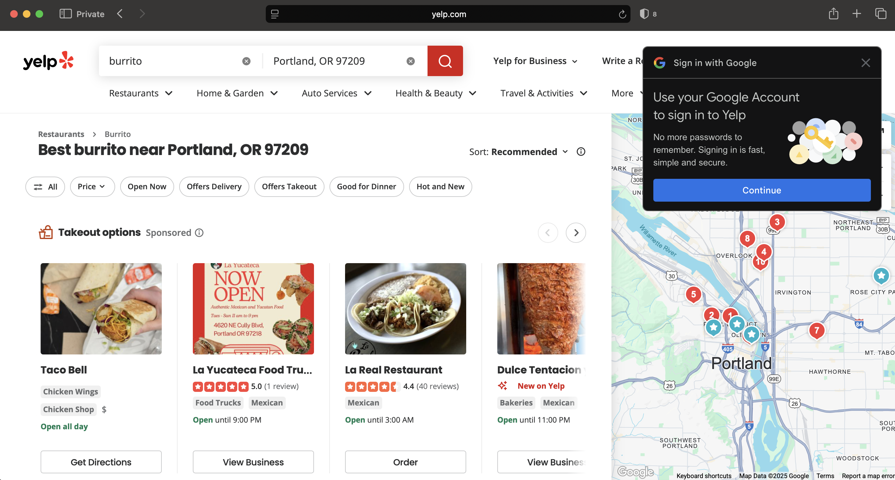

+++
title = "Where's your band"
date = "2025-06-28"
updated = "2025-06-28"
+++

#### from the desk of [planetnineisaspaceship][planetnine]

# Where's your band

It was a gorgeous fall evening in Skokie, Illinois.
Crisp and cool, the type of weather that my West Coast friends would call frigid today, but was just right for those of us in Chicago who wore hoodies year round. 
I was standing outside in a huddle of teenagers smoking in between bands at the house show going on in my friend's basement. 

"Man, that last band really sucked." 
It wasn't my most eloquent critique of an artistic endeavor, and one probably more borne out of a need to be an angry teen than comment on the aesthetics of the show.
Next to me, a guy spun around.

"Where's your band man?"

He was older, probably nineteen or twenty, an unfathomable four year gap to my sixteen year old sensibilities.
I'm in my fourties now as I write this, and that his admonishment has stayed with me this long is a good indication he was on to something.

## Some history

In 1999, the cultural vanguard that is The Simpsons released [Guess Who's Coming to Criticize Dinner][simpsons].
In the episode, Homer becomes a food critic who is first terrible at his job because he loves everywhere, and then is bad at his job because he needlessly criticizes everything. 
I'd be curious to know what Gen Z thinks of the episode as one of the casualties of our increasingly online world is the professional critic. 

Prior to the internet, getting your opinion in front of more people than your friends required a gatekept platform monetized through circulation and/or viewership numbers. 
This meant that those who had opinions that would circulate were, for the most part, credentialed in whatever discipline it is they were critiquing. 
One of the things that people who critique disciplines they're a part of have, in general, is some respect for the craft--one that is shown as a modicum of respect for at least those who are trying.

In 2004, former PayPal execs (man those assholes seem to be behind everything stupid on the internet), launched Yelp. 
Yelp had the novel idea of letting any Tom, Dick, and Harry with a keyboard write a review for any business regardless of any credentials. 
The crowd-sourcing of critique is a fascinating and dynamic transition from expertise to democratization. 

Whether it's been good, bad, or neutral is the topic of this post. 

## My band

I would, like five years later, start a band.
It was not entirely not to spite that dude at that house show.
It did, just as I suspect that guy knew, open my eyes to what he was talking about, and I'm thankful for the perspective. 

See, it is not the case that folks can't or shouldn't have opinions on the quality of any media they consume, of course they can.
It's that deciding to get in front of any group of people and present something you've created is hard, and you don't need some dickhead saying you suck right outside of the venue.
Sometimes showing appreciation for the craft is just keeping your mouth shut. 

It also demonstrated to me that getting on that stage is sometimes the end in itself.
Other people's opinions aren't really why you pick up the guitar. 
I mean, maybe that's it for some people, but it wasn't for me.

[Doing things for the sake of doing them is the subject of this other post.][boiling]

## Follow the money

If you've ever read anything else that I've written then you know that my main axe to grind is with internet monetization, and the "democratization" of reviews is no exception.
So let's dive in.

Gene Siskel and Roger Ebert were the popular film critics of the rival newspapers the Chicago Tribune, and the Chicago Sun-Times respectively. 
Together they hosted a weekly film critic show on PBS when I was a kid. 
It was a brilliant move of coopetition as their show likely upped circulation numbers for both newspapers. 

Newspapers, and public broadcasting revenues are both driven by circulation/viewership. 
The more people consuming the media, the more revenue.
This incentives a quality show, and quality columns from both Siskel and Ebert. 
The two of them rose to cultural prominence for America's number two cultural export (music's number one).

Yelp, on the other hand, is a discovery tool just like a search engine. 
Here's what happens when I search for burrito on Yelp:

Awesome.
I was in the mood for some Taco Bell when I went searching for burritos in one of the best food cities in the country.

I was gonna checkout what's after this row of sponsored things, and say at least that was good, but guess what.
It's more ads. 
One for a burger place.
Another for Top Golf.

Seriously fuck this shit.

## The Demos

The summer of 1997, I watched every movie that came out in theaters. 
I lived across the street from a movie theater, I didn't own a car, and the girls didn't go to the pool every day so I had to fill my time with something.
I don't remember all of the movies I watched, but I do remember I walked out of one, the only movie I've ever walked out of: Good Burger.

Here is an excerpt of Roger Ebert's review of Good Burger:

> “Good Burger” was not made for me, and if I say I didn’t much enjoy it, that wouldn’t be useful information. The movie was made for daytime viewers of Nickelodeon, and it’s a spinoff from a character first seen in the cable channel’s “All That” comedy series–Ed, a fast-food worker whose life and dreams are dominated by his love for his work, and whose catchphrase, “Welcome to Good Burger,” is as well-known to kids as “Where’s the beef?” is at the other end of the age spectrum.

Excellent. 
If I had read that, I probably would have skipped the movie. 
It wasn't that it was terrible, it was just for a much younger audience. 
One that I might be able to appreciate now as a father, but that just didn't do it for me as a teenager. 

Here is the review I just pulled up from the crowdsourcing on rotten tomatoes:

> This movie is fantastic. The character are fun, and like silly, Ed and his friendship with Dex was great, Ed was funny, and this movie is so funny, one of the best comedy films of all time.

Really Conor S.?
One of the best of all time? 
I'm going to need to see that list. 

## Who's Conor S.?

If you're unfamiliar with digital identity, and don't want to read my [15 part masterpiece on the subject][identity], let me give you the tl;dr: Conor S. may not exist as you imagine him.
Perhaps you read his review, and concluded he was a well-intentioned internet denizen with questionable taste in cinema, and perhaps a particular taste for plants. 
But since this is an unverified account on the internet, he could be a she, or an overworked and underpaid worker from a country lacking labor laws, or in this day of large language models he could even be another computer.

You could even train a machine to believe Good Burger is in fact one of the best comedy films of all time so that for the machine, this review is objectively true. 
How's that Philosophy of Aesthetics professors!

Rotten Tomatoes seems rather innocuous as far as spurious reviews are concerned, but what about Yelp, and Google?
What incentive do either of those platforms have to display or highlight reviews from establishments that aren't paying them money?
Why do we trust, implicitly, the "crowd sourced" "analysis" of platforms whose whole design is pay-to-play?

## Did we ever care though?

Back in those days of going to shows in Chicago, there was perhaps the greatest all ages venue of all time in the Fireside Bowl. 
America's puritanical past enforces strict limitations on minors' ability to interface with alcohol with one notable exception: event spaces.
Without this exception, your first baseball game would be at 21, and wouldn't hit quite the same way.

Thanks to a history I don't care to look up, there was one kind of establishment in Chicago zoned like a stadium that wasn't a stadium, the bowling alley.
Thanks to this zoning, the Fireside Bowl was able to supply concerts to rockers of all ages, and alcohol to those that the laws of the land allowed, and thus this venue of legend was born.

There was a show that if you were there is certainly etched in your memory. 
The penultimate band was a local group called Wolfeyes, and the headliner was a two piece no one had heard before called Lightning Bolt. 

I remember standing about a quarter of the way back from the stage vividly as the last chord of Wolfeyes set faded away, and was immediately cut into by the grinding dissonance that only a live show cranked up too loud can give you.
Everyone in the crowd turned around to see Lightning Bolt.
One member behind a tattered bass guitar with one guitar string that was already polluting the air with the fury fitting their name, the other member bent in half atop a full-stack plus of monitors and speakers.
Once enough eyes were on him, he lept down to the drum throne waiting for him and joined the noise in perfect time.

They sold all their merch that night, and more online I'm sure, and their next show in town sold out.

I'm pretty sure they didn't buy any ads.

The scale of aggregation that the internet allows gives a skewed view of what a decision point is, and how it should be made. 

"Should I go see the Lightning Bolt?"
"Yes."

"Should I get Taco Bell when I want a burrito?"
Yelp says yes.
What do you say?

Did we ever really care what Ebert had to say about a movie?
Maybe, but that was easily overridden by the people whose opinion we really care about, our family and friends.
Not only do we trust their opinion, but they know our preferences--I can gaurantee you no one that knows me is recommending Taco Bell, and Yelp is tapped into multiple spyware conglomorates I'm sure so it should know better.

## Word of mouth is king

Marketers all over will tell you there is no substitute for word of mouth.
It's fundamentally where recommendations come from.
If they came from random reviews on the internet then _that_ would be monetized, and not the ads that supplant them. 

So why not incentivize that?
Why not let people add themselves to a transaction pipeline where they get a little piece of recommending things to their family and friends?
Because then if they get too noisy with their recommendations, you can tell them to shut up lol...unlike ads on the internet.

[planetnine]: https://wiki.planetnineisaspaceship.com
[simpsons]: https://en.wikipedia.org/wiki/Guess_Who%27s_Coming_to_Criticize_Dinner%3F
[boiling]: https://opensource-force.github.io/osf-blog/posts/on-boiling-the-ocean/
[identity]: https://opensource-force.github.io/osf-blog/posts/you-are-not-a-number/

****
****
