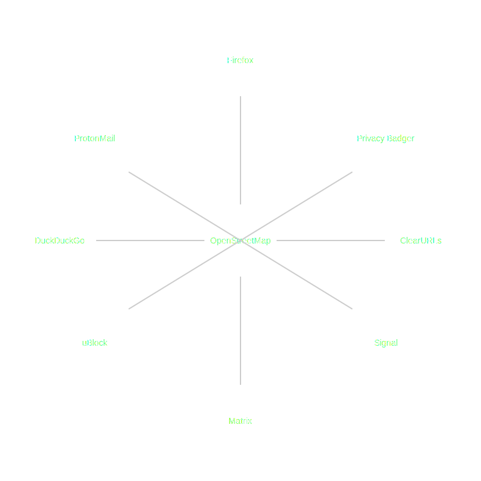

+++
title = "Part 11 - Then there were nazis"
date = "2025-02-02"
updated = "2025-02-02"
+++

## Every party's a just a party until there're nazis--then it's a nazi party

### The frontlines

In 2018, the EU passed the first real protections against the incredible spying apparatus the internet had become.
Probably the most noticable thing it did from a day-to-day perspective is that it makes websites which use cookies to track you have to disclose that they do so, and make them opt-in.
How many of y'all know how that works, and what you should opt-in to?
How many of you care to learn?

I'll give you two guesses as to who the biggest provider of cookie-based tracking is.

And here's how that tracking works. 
Google and Meta each give you a number.
Every time you log in to anything anywhere, you're given another number.

Then Google and Meta spend billions and billions of dollars making sure that they can tie the second number to the first. 
Then that first number is given some set of lifetime-values: the amount of money you're likely to spend based on your demographics, and your personality, all of which they know because they've been spying on you since the first time your mouse clicked login.

And somewhere, deep in the bowels of a network you're not invited to, they've added those two numbers together, and probably handed it off to all the governments that they regularly break the regulations of with impunity. 
I don't know what this number looks like, but in computers we have these things called universal unique identifiers (UUIDs), and they look like this: C6B20666-6AF4-4DF6-AB57-8F47A429D415. 

And that's what you and I are: C6B20666-6AF4-4DF6-AB57-8F47A429D415, just a hexadecimal number, followed around the internet by the largest corporations the Earth has ever known. 

Against this there are browsers blocking trackers like Firefox and even Safari, browser extensions fighting back like Privacy Badger and ClearURLs, platforms like signal and matrix for messaging, ad blockers like UBlock, DuckDuckGo for search, Protonmail for email, OpenStreetMap for maps, self-hosted cloud apps you can run in your house. 

These are the projects on the frontlines of this battle. 
Please check them out and give them your support.

### Fuckin' nazis

My dad's favorite movie is Patton. 
The movie begins with the incomporable George C. Scott's rendition of the titular general's speech to the third army in advance of the allied invasion of France. 
It's a good speech.

I remember watching it as a kid, one of those memories that's not really continuous with anything else, just some moment you remember for some reason or another.
There's a part where Scott's Patton says, "we're going to hold them by the nose, and kick them in the ass!" and my dad turned to me and said, "that's really what he did. His army would hold the front, and then attack the rear."

And so when the richest man on Earth threw two nazi salutes up at the inauguration of the president that my dad tried to overthrow the government for it hit a bit personally.
My dad may have forgotten about the war that his dad fought in, but hearing about it left an impression on me.

So I figured what worked for Patton, might just work for me, and I got to work on the kick them in the ass part.

The specifics of the work are far too much to go into here, but the gist of it is this: build a system that

a) allows for monetization that isn't ad-based

b) allow users to proliferate their digital identities

c) mess with existing notions of identity

For now, I'll just ask that you take my word on a). 
It's obviously quite important, but again too big for here.[^1]

For b) we already know the model, but we have a lot more computing horsepower to go along with it.
You just bring back the handle--Ramdatooki, zweibel, and zkpunk can all live again. 
And why don't we throw in anonymity alongside pseudonymity. 

Of course websites aren't just going to switch to handles overnight, and remembering which ones you used where is impossible, so what if we treated it like a password manager?
And what if we setup a mail server that gave everyone random site-by-site emails that did nothing other than confirm themselves when users signed up for and in to things?
And then, what if we just signed up a few extra users every time you went somewhere, and poked around at some things?

And thinking about that, and c), what if we took all the accounts on social media that people are abandoning because of the nazi thing, and start handing them to people who turn them into zombie bots, and all of a sudden uuids like C6B20666-6AF4-4DF6-AB57-8F47A429D415 started being into different things? 
What happens to the advertising platforms when all of the spying that they rely on suddenly becomes junk, _not_ because we undid 30 years and trillions of dollars worth of spying infrastructure, but because the numbers that they think we are just aren't us anymore?

 

--------------------

 

[Continue to part 12](/posts/you_are_not_a_number/part-12)

[fbvduguid]: https://en.wikipedia.org/wiki/Facebook,_Inc._v._Duguid
[linktree]: https://www.adamenfroy.com/linktree-alternatives
[onion]: https://theonion.com/t-herman-zweibel-in-memoriam-1819583647/
[birthday]: https://en.wikipedia.org/wiki/Birthday_problem
[elwood]: https://en.wikipedia.org/wiki/Elwood_Edwards
[oauth]: https://www.rfc-editor.org/rfc/rfc5849
[dynamo]: https://www.allthingsdistributed.com/files/amazon-dynamo-sosp2007.pdf
[bitcoin]: https://bitcoin.org/bitcoin.pdf
[sim]: https://en.wikipedia.org/wiki/SIM_swap_scam
[investigation]: https://www.vice.com/en/article/fcc-propose-fines-verizon-att-sprint-tmobile-selling-location-data/
[oh-the-forties-were-a-looong-time-ago]: https://www.nationalgeographic.com/history/article/141207-world-war-advertising-consumption-anniversary-people-photography-culture
[flatiron]: https://en.wikipedia.org/wiki/Flat_Iron_Building_(Chicago)

[^1]: The overarching idea is to make it much easier for people to simply purchase things directly from created content. This actually isn't as technically hard as you might think now in 2025, but it is difficult to explain because it is _very_ different from how the internet works today. Once I write up that blog post, I'll link it here.
