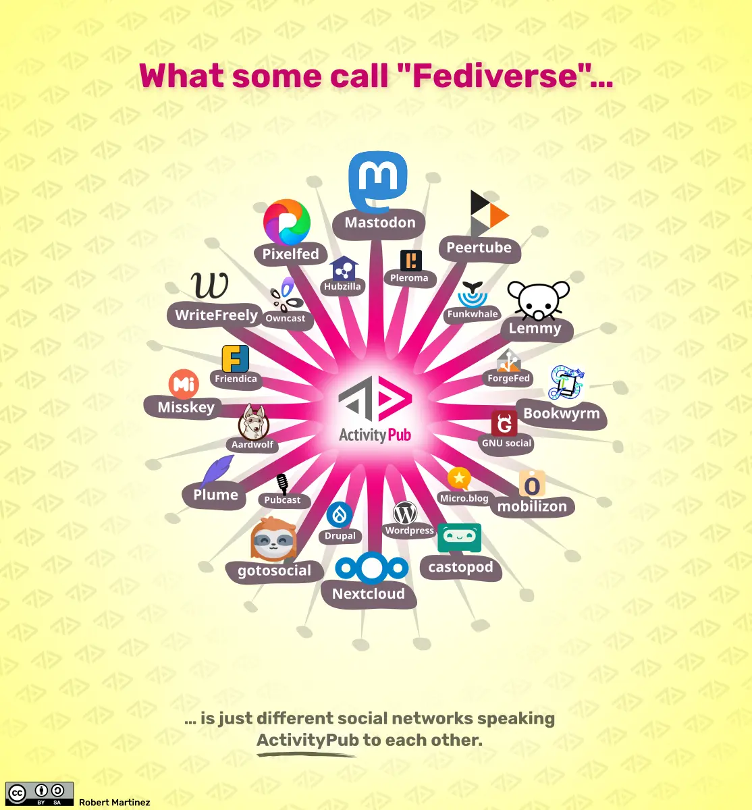

+++
title = "Part 13 - The third place"
date = "2025-02-02"
updated = "2025-02-02"
+++

## But what about all those places that already have my number?

In 2008, I was working at the Apple Store on Michigan Avenue in Chicago when the iPhone 3G, and the App Store launched.
Back in those days, the iPhone only worked with AT&T, and so we had to port a lot of customers numbers over to that service. 
To do so required a bunch of personal information from the account holder.

Since we were the only way to get these phones, our store served the plebes and elites alike, but if you were a big enough deal you could at least skip the line that wrapped around the block.
I handled a number of these special transactions, and it was after helping a very nice family get iPhones on their account where the account holder was a certain retired Bulls basketball player who might take it personally if I further reveal who he was, that I realized I was in the wrong business.

I decided then to go back to school.
It took two years to get all those ducks in a row, but in 2010, I sold or donated about 90% of my possesions, loaded the rest of everything I owned into my 2000 Camry, and moved out to Portland, OR. to go back to Reed College, the school I had done my freshman year at a decade earlier.

Moving is scary.
Leaving our comfort zones, the people we know and love, our haunts, the places we feel safe, our _communities_...that's scarier to most of us than even death.
It's why back in the day exile, and excomunication were the real bad punishments.
At least with the iron maiden you died fairly quickly, and didn't have to deal with the daily torment that people no longer wanted to be your friend.

Online though you don't have to leave, and go to a new place. 
I lived through all my friends ditching Friendster for MySpace, and then MySpace for Facebook. 
It was like that sad reminder that each one of us leaves the playground with our friends one last time, we just don't know it then.

But it didn't have to be that way. 
We don't have to choose one or another. 
That division is an _artificial separation created by companies looking to monetize your activity_.
What if the next time we all decide to move the next best thing, we require that thing to play nicely with others.

But of course we can't just ditch the interwebs to go out into the world where things already play nicely with others.
Gore forbid we just ditch the internet and go touch grass or something. 

### DID you, or DID you not?

There is one number we haven't talked about yet used to identify people online. 

DID stands for Distributed IDentifier.
It's a way of assigning a canonical id to a user within a distributed system.
The most popular system using DIDs right now is Bluesky, where if you own your own domain you can set your DID in a DNS record and have your handle be handle@<your-domain.com>.

A yoctosecond is 10^-24 seconds.
It's used to describe the lifetime of really elusive particles.
It's also about the time it took Meta and Google to connect your Bluesky DID to their uuids. 

I keep trying to update the wikipedia page with this info, but someone keeps erasing it.

The thing is, so long as distributed systems are trying to give you a single canonical identifier, the l337 coders at the gigantocorps will be linking them to their number for you, and serving you ads based on what you post on Bluesky. 

The Fediverse[^11] works in a similar way, but instead of giving you a canonical id for all of the Fediverse, your ids are stored in a server that is federated with the system. 
That server is typically only linked to one of the Fediverse's implementations, and so if you really really want to you can proliferate your identities across the Fediverse, but to do so you need different emails, and you need to connect to a bunch of different servers, and since this isn't a common use case, none of the existing apps are built to do this. 

I want to be clear that I really like the Fediverse, and AT-protocol endeavors like Bluesky. 
They are absolutely a step in the right direction, and if they were built now, I think they would have been more careful with how identity was handled. 
As they exist, the protocols are set, and changing protocols is very difficult as ipv6, tls 1.3, and HTTP/2 can attest to.

The goal is to reward and monetize the content creators on these platforms for blazing the trail, but monetization is out of the scope of this doc.[^14] 

## We're living in a society

Humans are social animals.
That's the axiom of social media, but how social is social media today, and how much of it is just short quips of entertainment?

One day in the car, after our son was born, my wife turned to me and said, "I wish there was a place that adults could just like go, and hang out, and talk with each other, and maybe other adults. Away from kids you know?"

I chuckled and said, "That's called a bar babe. You just described a bar."

I've been to a lot of bars. 
You know what makes a good bar? 
People being there when you arrive.

At first it's the bartender, so you get to know them. 
Then it's regulars.
Then you and your friends become regulars so you know one of y'all will be there.

This worked before texting.
And it worked before the bar.

Summer break before eigth grade, I spent most of my days riding my bike to the pool. 
That's where my friends were. 

Then it was the mall.
Then it was Pete's garage.
Then it was Skippy's house.
Then it was the gazebo.
Then it was Jack's.
Then it was the Quad.
Then it was the Manor.

and so on.

These places are third places. 
Your home is the first place, your job the second place, and your third place is where you go for your community.
Instagram is not your community.

There's been much written about the loss of third places, including the sociological dynamo Bowling Alone, which was written about this and other losses in community back in 2000. 
The general theme of these writings is that humans not congregating in person is leading to the crumbling and decay of society. 
We've replaced the places we'd go to solve the world's problems with places that're the source of those problems. 

I'm not here to tell you how to spend your spare time, but in trying to build something that could solve this identity problem, I felt it needed to have some sense of community to keep the feeling going.
The "social graph," a meaningless term for the notion that people are connected to each other, isn't possible when the computers don't know who you are. 
But online still needs its communities, so how do we do that?

### Well how does the bar work?

When I was working at Starbucks in my early twenties, I would hang out in this hip cozy cafe in the [Flat Iron building][flatiron] at the corner of Milwaukee, North, and Damen in Chicago's Wicker Park--a neighborhood so cool, it spawned a movie.

It was a large cafe with maybe three or four sections.
I hung out in the cool upper level, which I knew was cool because I was there.
And up there I met the other upper level regulars, a fine group of men and women whose names I've forgotten.

Is my life better or worse because I met these people before I had some way to save them in a database forever?
If somehow I found out there was a cafe reunion of some sorts would I go?
Life goes on you know?
Maybe we don't need to carry around a record of every person we've ever talked to for more than two minutes.

The cafes and bars work because they're there.
You can go to them or not.
If you keep going to them, they _become_ your third place--the community's built by the participants.

So what if that was how social media worked? 
What if instead of following people, and having to get people to follow you, you could "go to" places.
You like the place, you keep showing up and build the community.
You don't like the place, you're under no obligation to stay.

And so now when you leave one of these platforms where you've sunk a decade into building followers, you've got followers already because they're part of your _community_.

This isn't some far fetched dream, it's how the whole internet worked before they decided you had to be *you* online.
If you wanted to see what shows were playing that weekend, you'd hop into some chatroom for your genre of choice in your locale, give yourself the handle musicdude22, and just ask.
People would just like tell you.

Then maybe you'd hang around for a while, chat about tunes, learn some new bands, and then log off. 
Maybe you come back, maybe you don't.
It doesn't matter. 

The chatroom lives on, just sitting there to help the next audiophile find their next show. 

 

------------------

 

[Continue to part 14](/posts/you_are_not_a_number/part-14)

[fbvduguid]: https://en.wikipedia.org/wiki/Facebook,_Inc._v._Duguid
[linktree]: https://www.adamenfroy.com/linktree-alternatives
[onion]: https://theonion.com/t-herman-zweibel-in-memoriam-1819583647/
[birthday]: https://en.wikipedia.org/wiki/Birthday_problem
[elwood]: https://en.wikipedia.org/wiki/Elwood_Edwards
[oauth]: https://www.rfc-editor.org/rfc/rfc5849
[dynamo]: https://www.allthingsdistributed.com/files/amazon-dynamo-sosp2007.pdf
[bitcoin]: https://bitcoin.org/bitcoin.pdf
[sim]: https://en.wikipedia.org/wiki/SIM_swap_scam
[investigation]: https://www.vice.com/en/article/fcc-propose-fines-verizon-att-sprint-tmobile-selling-location-data/
[oh-the-forties-were-a-looong-time-ago]: https://www.nationalgeographic.com/history/article/141207-world-war-advertising-consumption-anniversary-people-photography-culture
[flatiron]: https://en.wikipedia.org/wiki/Flat_Iron_Building_(Chicago)

[^11]: Both The Fediverse, and Bluesky are implementations of distributed systems based on underlying protocols. The Fediverse's ActivityPub protocol, and thus The Fediverse, came first, but despite the first-mover advantage, lags behind Bluesky these days in user adoption. The reason for this is a combo of marketing and usability, and definitely outside of the scope of this footnote.

[^14]: Well I can't completely leave out the money. The idea is to make it much easier to transact on the internet, using the existing financial system, by being able to purchase from user content directly instead of needing it to redirect you to a store. 
