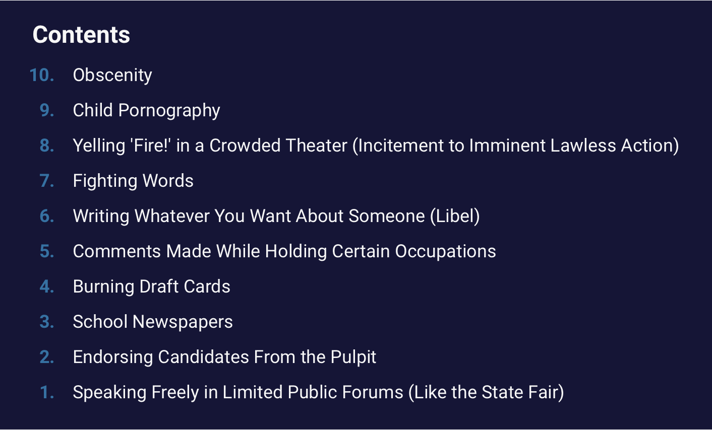

+++
title = "Part 14 - This part deals with internet denizens proclivity for posting nudity online. If that makes you uncomfortable, feel free to skip it."
date = "2025-02-02"
updated = "2025-02-02"
+++

## I know it when I see it

In 1964, supreme court justice Potter Stewart wrote,

> I shall not today attempt further to define the kinds of material I understand to be embraced within that shorthand description [regarding what is, and is not pornography]; and perhaps I could never succeed in intelligibly doing so. But I know it when I see it, and the motion picture involved in this case is not that.

The case concerns the showing of a French film, Les Amants (The Lovers), the parent's guide for this smutty offering on IMDB is the following:

> The plot of this film revolves around a married woman's unhappiness with her marriage and her subsequent affairs with other men. One of these affairs becomes sexual within the plot of the film, and we see the couple kiss passionately while laying on a boat on a lake. There is a subsequent scene in which the two make love. While the sex is not shown explicitly, we do see breast nudity and from the erotic nature of the scene it is clear that both people are enjoying their lovemaking.

The most scandalous part of this is probably the depiction of a woman enjoying her love making.

Now the government's standards of obscenity is one thing, and though this case was brought about due to the puritanism of Ohioans in the 1960s, I don't necessarily begrudge them setting their own standards for what is and what is not ok. 
The case was appealed to the US Supreme Court where The Constitution superceded the states' laws, and the system worked.

Many people who dive into anonymity in online identities tout themselves as first amendment purists, letting nazis and smut peddlers alike hang out as equals with everyone else.
Those of you still on Twitter may have noticed this.

I'm not of that opinion--and while we're at it, neither is the US Federal Government.
Here are ten things the US government doesn't consider free speech:

Of course, the US government isn't the government of the world, and these things aren't always defined, and some of them, like fighting words, take on different meanings in online contexts.
But ignoring the legal nuance, the real question is, should you try and enforce some restriction on what people say and post, how do you do that when people are anonymous?

On social media platforms where your profile is who you are, and you have some sunk cost wrapped up in gained followers, getting banned matters.
But on a platform where you can just spawn accounts at will, and reach people through some community space, what's the equivalent of a ban?

Rather than get bogged down on what is, and what isn't obscene, we'll move forward by talking about dicks.
Why? Because left to their own devices, dick-havers will put those things everywhere.
So below as I say dicks, feel free to fill in the details of whatever lewd or illegal material you care more about.

Whether or not putting a picture of a dick onto the internet in some capacity is illegal, is a matter of locale, but the requirement that others should have to _view_ that dick is a matter of personal preference.
So the goal is to create an anonymous platform that can handle both user preference for dicks, and some sort of excommunication for those who post dicks in places where it's illegal to do so.[^12]
 
Most social platforms allow for the opting in of NSFW content, and that seems like a good place to start. 
But that requires moderation since not everyone will add that flag to their NSFW content.
For our implementations, users will be able to add that tag, amongst others, so that people can filter out NSFW content without mod intervention. 
Tagging lets us get more specific as some people might want to see dicks, but not other sex organs, or other sex organs, and not dicks. 

The latter is a little trickier, and I've given it a lot of thought, and I don't really know how else to do it.

If you want to upload things, you've got to make a purchase.

### Are you in compliance?

Back in the early eighties, it became pretty obvious that transacting online was going to be a thing. 
When the world wide web went live in the mid-nineties, online eCommerce sites suddenly saw an explosion in the number of customers they could reach, and, as a result of the loosey-goosey security at the time, the credit card networks were nearing a billion dollars in fraud.
To combat this, the payments industry created the Payment Card Industry Data Security Standard (PCI DSS). 

If you're big enough for the credit card companies to care about, and you're found to not be in PCI compliance, they'll drop you and/or your payment processor will drop you, and you won't be able to take transactions anymore. 
When there's money involved, it's easy to ban people.

One of the things PCI compliance requires is that eCommerce sites not store people's credit card numbers anywhere.
Instead, these numbers are tokenized, and stored to be resolved at time of purchase by the payment processors. 
This means that your details are anonymized to the eCommerce site, but the banks know who you are if needed.

Like say if you're posting illegal shit online.

It's not perfect, but requiring a purchase to post introduces some safety mechanism against people posting gnarly stuff--moreso than just emails and ip addresses.
And if you don't want to post, you don't have to buy anything.
And if you do want to post, but you don't want to buy anything, you can use open platforms with their own gatekeeping like Bluesky.

### Aren't the banks just as bad?

Maybe. 
But one problem at a time.

 

--------------------

 

[Continue to part 15](/posts/you_are_not_a_number/part-15)

[fbvduguid]: https://en.wikipedia.org/wiki/Facebook,_Inc._v._Duguid
[linktree]: https://www.adamenfroy.com/linktree-alternatives
[onion]: https://theonion.com/t-herman-zweibel-in-memoriam-1819583647/
[birthday]: https://en.wikipedia.org/wiki/Birthday_problem
[elwood]: https://en.wikipedia.org/wiki/Elwood_Edwards
[oauth]: https://www.rfc-editor.org/rfc/rfc5849
[dynamo]: https://www.allthingsdistributed.com/files/amazon-dynamo-sosp2007.pdf
[bitcoin]: https://bitcoin.org/bitcoin.pdf
[sim]: https://en.wikipedia.org/wiki/SIM_swap_scam
[investigation]: https://www.vice.com/en/article/fcc-propose-fines-verizon-att-sprint-tmobile-selling-location-data/
[oh-the-forties-were-a-looong-time-ago]: https://www.nationalgeographic.com/history/article/141207-world-war-advertising-consumption-anniversary-people-photography-culture
[flatiron]: https://en.wikipedia.org/wiki/Flat_Iron_Building_(Chicago)

[^12]: There are, of course, things that are so heinous, that even if they aren't illegal in the uploader's juristiction it will result in excommunication.
