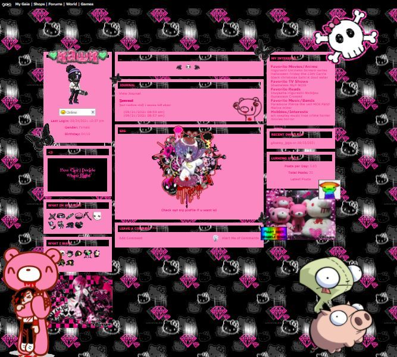

+++
title = "Part 4 - Looking for my space"
date = "2025-02-02"
updated = "2025-02-02"
+++

## Humans are social animals right?

Somewhere in the early aughts, my friend bought the domain mauledbytigers.com and set up a message board. 
The only significant world event I can remember circulating on the board was the Mr. Hands video, an event that if you do not know about I highly suggest you do not look up.[^5]
That event happened in 2005, so that gives you the year.

I was known as Lazer back in those days, and part of the Chicago music scene. 
It was a big scene, and my contribution largely insignificant, but I did meet a lot of people, and there are more than a few who know me as Lazer to this day.
The problem, of course, was how to keep up with all of these friends. 

Luckily tech had the answer again!

In 2002, an enterprising Canadian named Jonathan Abrams started work on a new social network.
In early 2003 he launched Friendster. 
Friendster introduced a new problem to the internet--hyper scaling. 
AOL had topped off around three million users.
A decade later, Friendster would hit 100 million users, and making things work for those many people was a bit of a challenge.

### A thumb on the scale

Friendster was the first, but the two that came next, at least in the states, were the real players to define the social networking era. 
One lives on in my mind as a symbol of freedom and awesomeness, and the other is possibly the most damaging entity on the planet.
Let's start with the former.

If you're over a certain age, this image needs no introduction.
When you signed up for MySpace, this was your first friend: Tom from MySpace.
As I write this, tech billionaires are capitulating to right-wing hostility, and endeavoring to make life as hard as possible for everyone other than themselves.
So the fact that Tom sold MySpace for $500 million+, and then just kind of disappeared, is really refreshing.

After Friendster, and MySpace, the Winklevoss Twins had the genius idea of ripping off those websites, but making it exclusive to Harvard students so as to separate themselves from the dirty plebes around them.
They turned to the obviously talented programmer of the website they used to drunkenly rate coeds on campus, and together that braintrust created Facebook.[^6]

A lot has been written on these first hyperscaled social networks, and why Facebook won when the others didn't.
Like with anything else with pontificating pundits, most of it is reductive, and kind of lame.
Let me give you the inside scoop.

MySpace had this amazing feature where you could grab snippets of web code, and paste it onto your home page. 
If you wanted your page to be bubblegum pink with sparkles around the text, and rainbows raining down, all you had to do was paste in some text.
And that's how it should be, because, after all, _it was your fucking space._

From a performance standpoint, this made everything load slow as molasses, and for anyone who hadn't been online ten years ago, made the site pretty unusable. 
Us twenty-somethings were the target demographic, and we loved it, but it left the younger folk kind of uninterested (not that big of a deal).
For the older folk though it left Facebook with the perfect opportunity.

Somebody at Facebook had the critical insight that for most people, and definitely anyone who has left the devil may care time of their lives, their friends just weren't all that interesting.
Instead, using their friends to target shared interests in a timeline feed kept people more engaged. 
And the timeline feed loaded fast, and always had good stuff.

In the world of digital monetization there's a big difference between people in their mid-twenties, and people over thirty-five because the latter has money, and the former doesn't. 

For a brief moment in time, everyone was touching code just a bit to make things fun on the internet. 
It was beautiful, and important, and that shard of collective creativity was shattered by the most boring gray with blue accents bs like the time thieves in Momo. 

|  |  |
|:--:|:--:|
| *It could have been this, but instead we got ads* | *The people who like this UI are the ones you worry about "making new friends" online now* |

Of course, now we know who came out on top--a company who has single-handedly advanced disinformation and destructive rabbit holes in the name of ad-based profit moreso than any entity in history. 

Tom, I wish you the best, but I wish you'd never left.

------------

[Continue to part 5](/posts/you_are_not_a_number/part-5)

[fbvduguid]: https://en.wikipedia.org/wiki/Facebook,_Inc._v._Duguid
[linktree]: https://www.adamenfroy.com/linktree-alternatives
[onion]: https://theonion.com/t-herman-zweibel-in-memoriam-1819583647/
[birthday]: https://en.wikipedia.org/wiki/Birthday_problem
[elwood]: https://en.wikipedia.org/wiki/Elwood_Edwards
[oauth]: https://www.rfc-editor.org/rfc/rfc5849
[dynamo]: https://www.allthingsdistributed.com/files/amazon-dynamo-sosp2007.pdf
[bitcoin]: https://bitcoin.org/bitcoin.pdf
[sim]: https://en.wikipedia.org/wiki/SIM_swap_scam
[investigation]: https://www.vice.com/en/article/fcc-propose-fines-verizon-att-sprint-tmobile-selling-location-data/
[oh-the-forties-were-a-looong-time-ago]: https://www.nationalgeographic.com/history/article/141207-world-war-advertising-consumption-anniversary-people-photography-culture
[flatiron]: https://en.wikipedia.org/wiki/Flat_Iron_Building_(Chicago)

[^5]: I told you not to look it up

[^6]: This story is a little different than what I've represented here, and this is mostly based on my recollection of the film the Social Network, which was itself inaccurate, but I don't much care. Facebook is the largest deseminator of disinformation on the planet, and I'm not too worried about them getting a taste of their own medicine.

