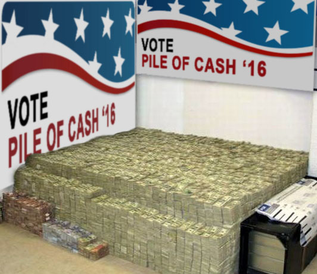

+++
title = "Part 7 - At least you have the same rights as money"
date = "2025-02-02"
updated = "2025-02-02"
+++

## What if we just got rid of money?

Little more than a month after Lehman Brothers broke the buck, Satoshi Nakamoto, who may or may not exist, published a whitepaper entitled ["Bitcoin: A Peer-to-Peer Electronic Cash System."][bitcoin]
In it he described a system that used asymmetric cryptography, and a new kind of datastore called a blockchain to allow for a transaction system.
In the system, transaction values would be represented by a fungible token called a bitcoin. 

Chances are you've heard of this system.

Bitcoin, and the crypto category isn't really a part of this story. 
I introduce it here because Satoshi introduced a third identifier for people: the public key, and also because it's the asset class that joins what's in the next few paragraphs in being the money sink that the banks need to not crash everything again.

## More bubble?

Now you may be wondering what, if anything, happened to make it so that the bubbles of 2001 and 2008 didn't continue to happen throughout the 2010's.
Well, it turns out there was a crucial asset class that had long gone ignored in the hyper-capitalist United States. 

In 2010, the US Supreme Court passed the Citizens United decision, which decided that the first amendment considered money to be speech, and that there could be no limit on political contributions from institutions.
And you know... politics have been totally cool in the US ever since.

Wherever you stand politically, I hope you can at least recognize the disparity between the US, and other countries' approaches to online protections. 
A reality that certainly isn't helped by US companies being able to pour unlimited cash into political campaigns. 

The EU's General Data Protection Regulation (GDPR) is the most notable. 
It's what's responsible for those giant cookie banners that show up everywhere on the web.

Without the GDPR, everyone would get to track you without you being none the wiser--just like the gigantocorps would like.
But the GDPR's reach across the pond is limited, and with politics being the cash-hungry beast it is, the gigantocorps coffers wield non-negligible influence around here, and would regardless of who's in charge.
We'll have to wait about a decade for where this really reers its head, but if you're already feeling uneasy, I wouldn't blame you.

-------------

[Continue to part 8](/posts/you_are_not_a_number/part-8)

[fbvduguid]: https://en.wikipedia.org/wiki/Facebook,_Inc._v._Duguid
[linktree]: https://www.adamenfroy.com/linktree-alternatives
[onion]: https://theonion.com/t-herman-zweibel-in-memoriam-1819583647/
[birthday]: https://en.wikipedia.org/wiki/Birthday_problem
[elwood]: https://en.wikipedia.org/wiki/Elwood_Edwards
[oauth]: https://www.rfc-editor.org/rfc/rfc5849
[dynamo]: https://www.allthingsdistributed.com/files/amazon-dynamo-sosp2007.pdf
[bitcoin]: https://bitcoin.org/bitcoin.pdf
[sim]: https://en.wikipedia.org/wiki/SIM_swap_scam
[investigation]: https://www.vice.com/en/article/fcc-propose-fines-verizon-att-sprint-tmobile-selling-location-data/
[oh-the-forties-were-a-looong-time-ago]: https://www.nationalgeographic.com/history/article/141207-world-war-advertising-consumption-anniversary-people-photography-culture
[flatiron]: https://en.wikipedia.org/wiki/Flat_Iron_Building_(Chicago)

