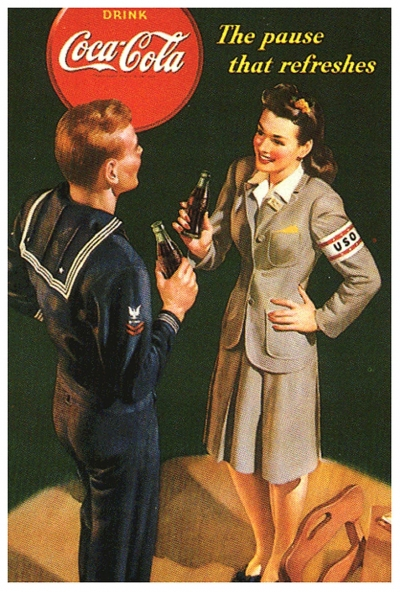

+++
title = "Part 9 - Are you entertained?"
date = "2025-02-02"
updated = "2025-02-02"
+++

## The boob tube

The television was invented in the 1920s.
Its history is long, and interesting, but out of scope for this doc. 
Except for one part. 

In 1941, before a sunny baseball game between the Brooklyn Dodgers, and the Philadelphia Phillies, a brief ad, the first television ad in the US aired. 
It cost $9 (close to $200 today) and aired to about 4,000 people. 
I have no doubt that this would have opened the flood gates regardless of what was going on in the world, but as it would happen 1941 was a rather auspicious year.

On December 7th of 1941, the Japanese attacked Pearl Harbor and the United States became a full participant in World War II. 
To produce the kind of war-time provisions needed to fight that war, the government rationed a bunch of things.
Pretty much any large manufacturer was rationed, or flat out bought up, by the government.

For their troubles, the government set up the War Advertising Council.
The council's mandate was to provide free or cheap advertising for these harmed businesses while also supporting the war effort. 
[You can see some of the sweet ads here][oh-the-forties-were-a-looong-time-ago].

The WAC, an auspicious acronym given their mandate, was essentially the propaganda engine for the war effort, but because it was American, it made sure to sell tires alongside white picket fences, and obedient dames for when you got home.

When the war ended, the US stood as pretty much the only industrial power not bombed significantly, and a bunch of twenty-somethings came home with cash in their pockets.
The WAC disbanded, companies started producing again, and all they had to do was replace uniforms with suits, and they had their advertising ready to go. 
Print, film, and radio were all known mediums, but one of the things all those soldiers were buying were tvs--the perfect new medium for companies looking to reach an audience. 

It didn't take long before one of the largest marketing firms in the country ACNielsen realized that advertisers would benefit from, and thus pay them for information about who was watching what.
To do this they went to a couple of towns in America, and had the good people there write down what shows they were watching. 
And this is how tv ratings worked for almost four decades, until cable joined the party.

With cable, Nielsen was able to make a box.
You could attach this box in between your cable and your tv, and it would record what you were watching for Nielsen.
For your troubles, Nielsen would pay you a couple bucks, and sell your demographic data and viewing habits for a bit more than those couple of bucks.

### The searchlights

I was maybe twelve years old when the family was driving home from some dinner at some American suburban culinary stalwart, when we saw the hollywood spotlights scanning the skies near our house. 
Intrigued, we ventured over to the grand opening of the hottest chain sweeping the nation in the first half of the nineties: Blockbuster Video. 
We of course had a perfectly fine video rental shop we already frequented, but Blockbuster was new and shiny, and closer to home, so we were hooked.

||
|:--:|
|*If you don't know the joy of cracking one of these open, and heteronormative act of inserting that casette into the VCR...idk maybe that's why the kids are having less sex these days*|

Blockbuster had a novel instrument for us--the Blockbuster card. 
At our local rental shop, you'd just leave your name, and they'd put you into their ancient phosphorescent green machine, and you'd be on your way.
Blockbuster had UPCs and scanners, and a laminated wallet-stuffer you could use to show people you were cool.

Prior to Blockbuster, there were some retailers which collected customer data into a nationwide database, but nothing that came close to Blockbuster's reach. 
At its peak, Blockbuster had close to a fifth of the US as members, all just givin' away when they rented War of the Roses four weekends in a row to get through a breakup.

Of course Blockbuster would blunder the world's transition from physicial to digital media, and Netflix would pick up the ball. 
What Blockbuster was doing with your rental habits seems lost to the ages, but Netflix has partnered with Nielsen to provide that information at the very least. 

And there you go, your tv too, just spying on you for advertisers to sell you more stuff.

------------

[Continue to part 10](/posts/you_are_not_a_number/part-10)

[fbvduguid]: https://en.wikipedia.org/wiki/Facebook,_Inc._v._Duguid
[linktree]: https://www.adamenfroy.com/linktree-alternatives
[onion]: https://theonion.com/t-herman-zweibel-in-memoriam-1819583647/
[birthday]: https://en.wikipedia.org/wiki/Birthday_problem
[elwood]: https://en.wikipedia.org/wiki/Elwood_Edwards
[oauth]: https://www.rfc-editor.org/rfc/rfc5849
[dynamo]: https://www.allthingsdistributed.com/files/amazon-dynamo-sosp2007.pdf
[bitcoin]: https://bitcoin.org/bitcoin.pdf
[sim]: https://en.wikipedia.org/wiki/SIM_swap_scam
[investigation]: https://www.vice.com/en/article/fcc-propose-fines-verizon-att-sprint-tmobile-selling-location-data/
[oh-the-forties-were-a-looong-time-ago]: https://www.nationalgeographic.com/history/article/141207-world-war-advertising-consumption-anniversary-people-photography-culture
[flatiron]: https://en.wikipedia.org/wiki/Flat_Iron_Building_(Chicago)

